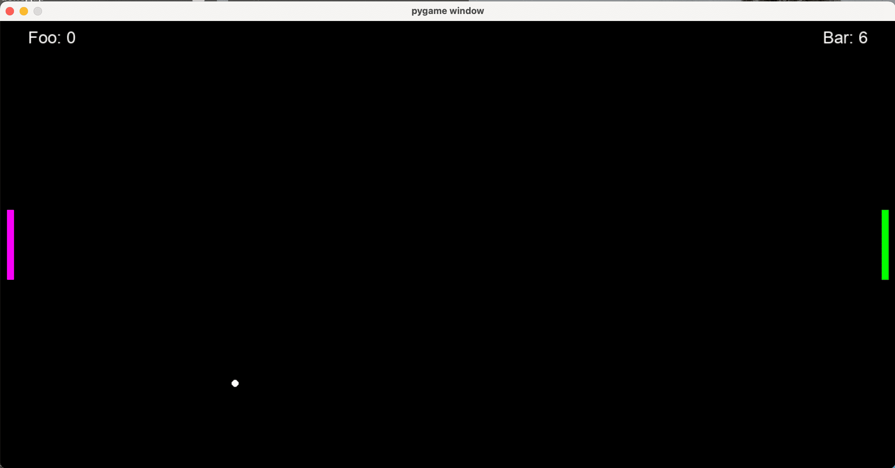

# # Python Symple Tennis Game

The main goal of this project is to learn the basics of OOP in Python by creating a simple Tennis game. Additionally, it may serve as a resource to help others learn as well. The project is built using the pygame library.




### 🎮 Control

W - Player0 Up
S - Player0 Down
⬆️ - Player1 Up
⬇️ - Player2 Down

### Dependences

```
pip install -r requirements.txt
```
